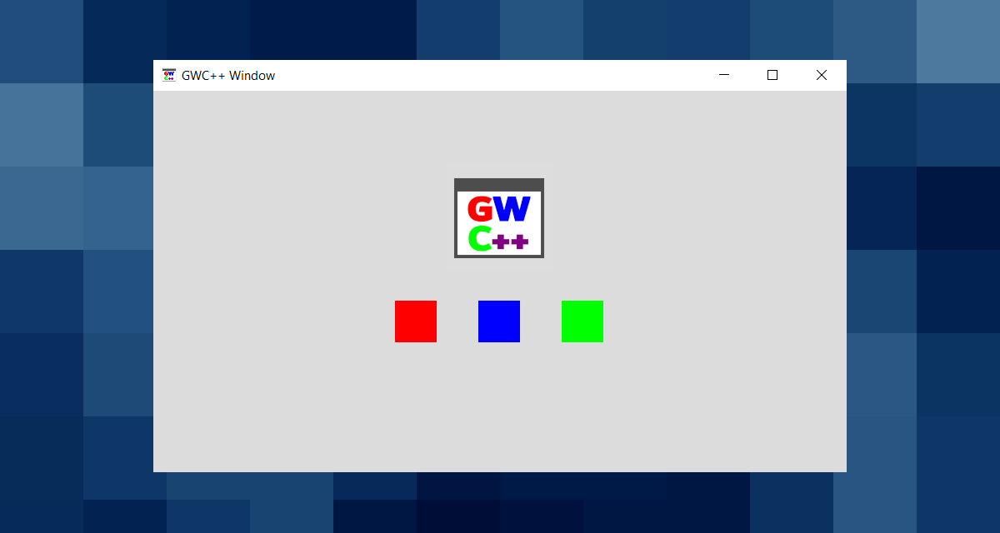

# GWC++



GWC++ o Graphic Window for Console Application è una libreria scritta in C++/CLI che mette a disposizione dei form personalizzati da utilizzare come tela da dipinto per applicazioni console .NET e C++ native per Windows.

> ⚠ GWC++ è **SOLO** un esperimento. Ne consiglio l'utilizzo solo per divertimento.


# Indice

- [Rilasci](#rilasci)
- [Esempi](#esempi)
- [Compilazione](#compilazione)
- [Documentazione](#documentazione)
- [Strumenti](#strumenti)
- [Autore](#autore)
- [Licenza](#licenza)


# Rilasci

> 🎉 Una versione *"stabile"* di GWC++ è disponibile!

| Architettura<br /> versione | Ultima versione<br/> (Stabile)                                     | Ultima versione<br/> (Anteprima)                                   |
| :-------------------------: | :----------------------------------------------------------------: | :----------------------------------------------------------------: |
| x64                         | [Download](https://github.com/reallukee/GWCpp/releases/tag/v1.0.0) | [Download](https://github.com/reallukee/GWCpp/releases/tag/v1.0.0) |
| x86                         | [Download](https://github.com/reallukee/GWCpp/releases/tag/v1.0.0) | [Download](https://github.com/reallukee/GWCpp/releases/tag/v1.0.0) |


# Esempi

## Premesse

GWC++ offre la classe `GWC` per le applicazioni console .NET e `NGWC` per le applicazioni C++ native per Windows. Utilizzare la classe adatta al tipo di linguaggio e applicazione che si sta sviluppando. Nel caso di C++/CLI è possibile utilizzare entrambe le classi indistintamente.

## Applicazione console C#

```csharp
// main.cs

// Importo lo spazio dei nomi.
using GWCpp;

// Codice ...

// Istanza di GWC.
GWC Window = new GWC(850, 505, "GWC++ Test", 50, 50);

// Creo la finestra.
Window.StartWindow();

// Cambio le impostazioni di disegno.
Window.PenColor = new GColor(255, 0, 0);
Window.FontName = "Comic Sans";
Window.FontSize = 25.0F;

// Scrivo del testo.
Window.DrawString("GWC++", 250, 100);

Console.ReadKey();

// Chiudo la finestra.
Window.CloseWindow();

// Codice ...
```

## Applicazione console VB .NET

```vb
' main.vb

' Importo lo spazio dei nomi.
Imports GWCpp

' Codice ...

' Istanza di GWC.
Dim Window As New GWC(850, 505, "GWC++ Test", 50, 50)

' Creo la finestra.
Window.StartWindow()

' Cambio le impostazioni di disegno.
Window.PenColor = New GColor(255, 0, 0)
Window.FontName = "Comic Sans"
Window.FontSize = 25.0F

' Scrivo del testo.
Window.DrawString("GWC++", 250, 100)

Console.ReadKey()

' Chiudo la finestra.
Window.CloseWindow()

' Codice ...
```

## Applicazione console C++/CLI

```cpp
// main.cpp

// Importo lo spazio dei nomi.
using namespace GWCpp;

// Codice ...

// Istanza di GWC.
GWC^ Window = gcnew GWC(850, 505, "GWC++ Test", 50, 50);

// Creo la finestra.
Window->StartWindow();

// Cambio le impostazioni di disegno.
Window->PenColor = gcnew GColor(255, 0, 0);
Window->FontName = "Comic Sans";
Window->FontSize = 25.0F;

// Scrivo del testo.
Window->DrawString("GWC++", 250, 100);

Console::ReadKey();

// Chiudo la finestra.
Window->CloseWindow();

// Codice ...
```

## Applicazione console C++

```cpp
// main.cpp

// Importo lo spazio dei nomi.
#include "ngwc++.h"

// Codice ...

// Istanza di NGWC.
NGWCpp::NGWC* Window = new NGWCpp::NGWC(850, 505, "NGWC++ Test", 50, 50);

// Creo la finestra.
Window->StartWindow();

// Cambio le impostazioni di disegno.
Window->SetPenColor(NGWCpp::NGCOLOR{ 255, 0, 0 });
Window->SetFontName("Comic Sans");
Window->SetPenWidth(25.0F);

// Scrivo del testo.
Window->DrawString("GWC++", 250, 100);

system("pause");

// Chiudo la finestra.
Window->CloseWindow();

// Codice ...
```


# Compilazione

1. Installare l'ultima versione di [Visual Studio](https://visualstudio.microsoft.com/it/vs/).

    - Installare il carico di lavoro `Sviluppo di applicazioni desktop con C++`.
    - Installare il carico di lavoro `Sviluppo per desktop .NET`.
    - Installare il componente facoltativo `Supporto C++/CLI per Build Tools v143`.
    - Installare il componente facoltativo `.NET Framework 4.8 SDK`.

2. Clonare la repository.

    ```git
    git clone https://github.com/reallukee/GWCpp.git
    ```

3. Aprire con Visual Studio il file `gwc++.sln` o il file `gwc++\gwc++.vcxproj`.


# Documentazione

## Metodi

> ⚠ Non tutti i metodi elencati in questa sezione sono presenti e utilizzabili all'interno della classe `NGWC` e quindi all'interno di applicazioni C++ native per Windows.

### Finestra

- `StartWindow`
- `CloseWindow`
- `SuspendWindow`
- `ResumeWindow`
- `ShowWindow`
- `HideWindow`
- `GetMaxX`
- `GetRealMaxX`
- `GetMaxY`
- `GetRealMaxY`
- `RequestMouseDown`
- `RequestMouseUp`
- `RequestKeyDown`
- `RequestKeyUp`

### Disegno

- `DefaultPenColor`
- `DefaultPenWidth`
- `DefaultFillColor`
- `DefaultFontName`
- `DefaultFontSize`
- `ClearWindow`
- `SaveCanvas`
- `RestoreCanvas`
- `DrawPixel`
- `DrawLine`
- `DrawArc`
- `DrawBezier`
- `DrawString`
- `DrawImage`
- `DrawImageFromFile`
- `DrawIcon`
- `DrawIconFromFile`
- `DrawSquare`
- `DrawFullSquare`
- `DrawRectangle`
- `DrawFullRectangle`
- `DrawEllipse`
- `DrawFullEllipse`
- `DrawCircle`
- `DrawFullCircle`
- `DrawCurve`
- `DrawClosedCurve`
- `DrawPolygon`
- `DrawFullPolygon`
- `DrawPie`
- `DrawFullPie`
- `DrawFromScreen`


## Proprietà

> ⚠ Non tutte le proprietà elencate in questa sezione sono presenti e utilizzabili all'interno della classe `NGWC` e quindi all'interno di applicazioni C++ native per Windows.

> ⚠ In C++ non esisteno le proprietà per questo motivo all'interno di `NGWC` è necessario chiamare le funzioni `Get<Nome proprietà>` per ottenere il valore della proprietà e `Set<Nome Proprietà>` per impostare il valore della proprietà.

```cpp
// C++/CLI
System::String^ Title = Window->WindowTitle;
Window->WindowTitle = "New Title";

// C++
std::string Window = Window->GetWindowTitle();
Window->SetWindowTitle("New Title");
```


### Finestra

- `WindowStarted`
- `WindowClosed`
- `WindowTitle`
- `WindowIcon`
- `WindowIconVisible`
- `WindowLocation`
- `WindowColor`
- `WindowImage`
- `WindowSize`
- `WindowRealSize`
- `WindowSizeState`
- `WindowMinimumSize`
- `WindowMaximumSize`
- `WindowOpacity`
- `WindowAlwaysOnTop`
- `WindowInTaskbar`
- `WindowButtons`
- `WindowMinimizeButton`
- `WindowMaximizeButton`

### Disegno

- `PenColor`
- `PenWidth`
- `FillColor`
- `FontName`
- `FontSize`


## Strutture

### Gestite

- `GPoint`
- `GSize`
- `GColor`

### Non gestite

- `NGPoint`
- `NGSize`
- `NGColor`


## Enumerazioni

### Gestite

- `GMouseButtons`
- `GWindowState`

### Non gestite

- `NGMouseButtons`
- `NGWindowState`


# Strumenti

- GWC++

    - [Visual Studio 2022](https://visualstudio.microsoft.com/it/vs/)
    - [MSVC v143](https://docs.microsoft.com/it-it/cpp/build/reference/compiling-a-c-cpp-program?view=msvc-170)
    - [.NET Framework 4.8](https://dotnet.microsoft.com/en-us/download/dotnet-framework/net48)

- CSTest

    - [Visual Studio 2022](https://visualstudio.microsoft.com/it/vs/)
    - [.NET Framework 4.8](https://dotnet.microsoft.com/en-us/download/dotnet-framework/net48)

- VBTest

    - [Visual Studio 2022](https://visualstudio.microsoft.com/it/vs/)
    - [.NET Framework 4.8](https://dotnet.microsoft.com/en-us/download/dotnet-framework/net48)


# Autore

- [@reallukee](https://github.com/reallukee)


# Licenza

GWC++ è sotto licenza [MIT](./LICENSE).
