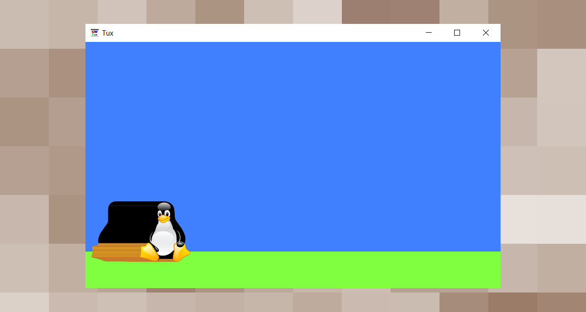

# GWC++


🧩 GWC++ o Graphic Window for Console Application è una libreria scritta in C++/CLI che mette a disposizione dei form personalizzati da utilizzare come tela da dipinto per applicazioni console .NET e C++ compilate con MSVC.

> ⚠ GWC++ è **SOLO** un esperimento. L'utilizzo è consigliato solo per applicazioni semplici e non professionali.


# Indice

**Contenuti interni**

- [Rilasci](#rilasci)
- [Utilizzo](#utilizzo)
- [Esempi](#esempi)
- [Compilazione](#compilazione)
- [Strumenti](#strumenti)
- [Autore](#autore)
- [Licenza](#licenza)


**Contenuti esterni**

- [Documentazione](./DOCS.md)


# Rilasci

## Binari

> ⚠ I file binari non disponibili per il download ma possono essere ottenititramite la [compilazione](#compilazione) locale di GWC++. Vedere la sezione [tag](https://github.com/reallukee/GWCpp/tags) per le versioni di GWC++.

## Template

| Descrizione                        | Download                           |
| :--------------------------------- | :--------------------------------: |
| Progetto console C++ con GWC++     | [Download](./templates/cpp.zip)    |
| Progetto console C# con GWC++      | [Download](./templates/csharp.zip) |
| Progetto console VB .NET con GWC++ | [Download](./templates/vbnet.zip)  |


#  Utilizzo

## STD (Standard) e CIL (Common Intermediate Language)

GWC++ è disponibile in edizione `STD` (Standard) e edizione `CIL` (Common Intermediate Language).La prima è compilata con l'ozione `/clr` ed è utilizzabile in applicazioni console .NET e C++ mentre la seconda è compilata con l'ozione `/clr:pure` ed è utilizzabile solo in applicazioni console .NET.

> ⚠ Entrambe le versioni di GWC++ richiedono Windows 7 o superiori e [.NET Framework 4.8 Runtime](https://dotnet.microsoft.com/en-us/download/dotnet-framework/net48). Sui sistemi operativi Windows 10 e 11 è sempre installato mentre su i sistemi operativi Windows 7 e 8.1 potrebbe essere necessaria un'installazione manuale.

## MGWC (Managed GWC) e UGWC (Unmanaged GWC)

GWC++ offre la classe `MGWC` (Managed GWC) per le applicazioni console .NET e `UGWC` (Unmanaged GWC) per le applicazioni console C++ compilate con MSVC. Utilizzare la classe adatta al tipo di linguaggio e applicazione che si sta sviluppando. Nel caso di C++/CLI è possibile utilizzare entrambe le classi indistintamente.

> ⚠ Se si vuole utilizzare la classe `UGWC` è necessario utilizzare la edizione `STD` di GWC++ e aggiungere il file [hgwc++.h](./gwc++/hgwc++.h) all'interno del proprio progetto. Inserire `#include "hgwc++.h"` all'interno dei file di codice sorgente dove è necessario `UGWC`.


# Esempi



> *"Tux su prato con cielo azzurro.".*

## Applicazione console C++

```cpp
// main.cpp

// Importo lo spazio dei nomi.
#include "ugwc++.h"

// Codice ...

// Istanza di UGWC.
GWCpp::UGWC* Window = new GWCpp::UGWC(850, 505, "Tux", 50, 50);

// Disegno il cielo.
Window->SetFillColor(GWCpp::UGColor(64, 128, 255));
Window->DrawFullRectangle(0, 0, 850, 430);

// Disegno il prato.
Window->SetFillColor(GWCpp::UGColor(128, 255, 64));
Window->DrawFullRectangle(0, 430, 850, 75);

for (int X = 0; X < 100; X++)
{
    Window->DrawImageFromFile("tux.png", X, 325);
}

// Richiedo la pressione di un tasto per terminare l'applicazione.
system("pause");

// Chiudo la finestra.
Window->CloseWindow();

// Codice ...
```

## Applicazione console C#

```csharp
// main.cs

// Importo lo spazio dei nomi.
using GWCpp;

// Codice ...

// Istanza di MGWC.
MGWC Window = new MGWC(850, 505, "Tux", 50, 50);

// Creo la finestra.
Window.StartWindow();

// Disegno il cielo.
Window.FillColor = MGColor(64, 128, 255);
Window.DrawFullRectangle(0, 0, 850, 430);

// Disegno il prato.
Window.FillColor = MGColor(128, 255, 64);
Window.DrawFullRectangle(0, 430, 850, 75);

for (int X = 0; X < 100; X++)
{
    Window.DrawImageFromFile("tux.png", X, 325);
}

// Richiedo la pressione di un tasto per terminare l'applicazione.
Console.ReadKey();

// Chiudo la finestra.
Window.CloseWindow();

// Codice ...
```

## Applicazione console VB .NET

```vb
' main.vb

' Importo lo spazio dei nomi.
Imports GWCpp

' Codice ...

' Istanza di MGWC.
Dim Window As New MGWC(850, 505, "Tux", 50, 50)

' Creo la finestra.
Window.StartWindow()

' Disegno il cielo.
Window.FillColor = GColor(64, 128, 255);
Window.DrawFullRectangle(0, 0, 850, 430);

' Disegno il prato.
Window.FillColor = MGColor(128, 255, 64)
Window.DrawFullRectangle(0, 430, 850, 75)

For X As Int = 0 To 100
    Window.DrawImageFromFile("tux.png", X, 325)
Next

' Richiedo la pressione di un tasto per terminare l'applicazione.
Console.ReadKey()

' Chiudo la finestra.
Window.CloseWindow()

' Codice ...
```


# Compilazione

1. Installare l'ultima versione di [Visual Studio](https://visualstudio.microsoft.com/it/vs/).

    - Installare il carico di lavoro `Sviluppo di applicazioni desktop con C++`.
    - Installare il carico di lavoro `Sviluppo per desktop .NET`.
    - Installare il componente facoltativo `Supporto C++/CLI per Build Tools v143`.
    - Installare il componente facoltativo `.NET Framework 4.8 SDK`.

2. Clonare la repository.

    ```git
    git clone https://github.com/reallukee/GWCpp.git
    ```

3. Aprire con Visual Studio il file `gwc++.sln` o eseguire lo script `build.cmd`.

    - **(Visual Studio)** Selezionare il profilo di compilazione e l'architettura di destinazione.

        | Profilo | Descrizione                                             |
        | :------ | :------------------------------------------------------ |
        | Debug   | Produce un'applicazione console con l'opzione `/clr`    |
        | Release | Produce una libreria dinamica con l'opzione `/clr`      |
        | Cil     | Produce una libreria dinamica con l'opzione `/clr:pure` |

    - **(Script)** Digitare l'architettura di destinazione.

        | Opzione | Descrizione                                        |
        | :------ | :------------------------------------------------- |
        | x64     | Esegue la compilazione a 64 bit di tutti i profili |
        | x86     | Esegue la compilazione a 32 bit di tutti i profili |

4. Dopo la compilazione i file binari possono essere trovati nella cartella `<Architettura>\<Profilo>`.


# Strumenti

- [Visual Studio 2022](https://visualstudio.microsoft.com/it/vs/)
- [Visual Studio Code](https://code.visualstudio.com/)
- [MSVC v143](https://docs.microsoft.com/it-it/cpp/build/reference/compiling-a-c-cpp-program?view=msvc-170)
- [.NET Framework 4.8](https://dotnet.microsoft.com/en-us/download/dotnet-framework/net48)


# Autore

- [@reallukee](https://github.com/reallukee)


# Licenza

GWC++ è sotto licenza [MIT](./LICENSE).
